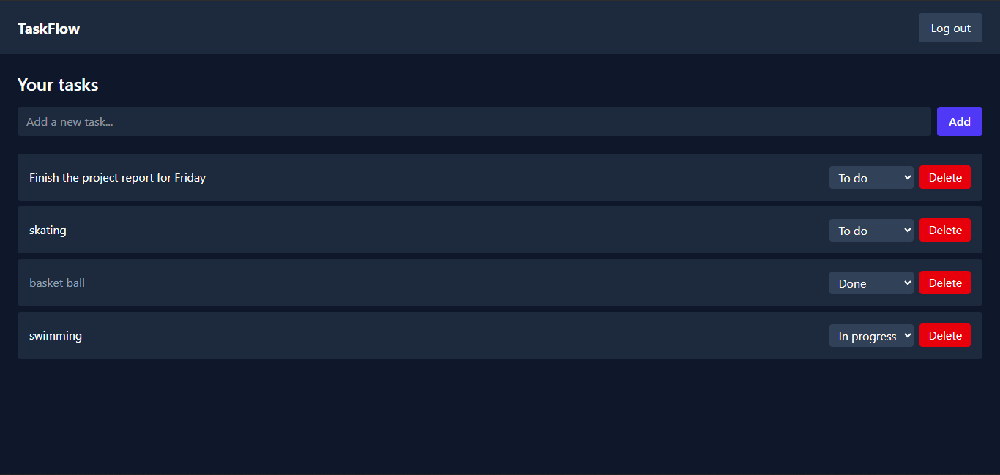
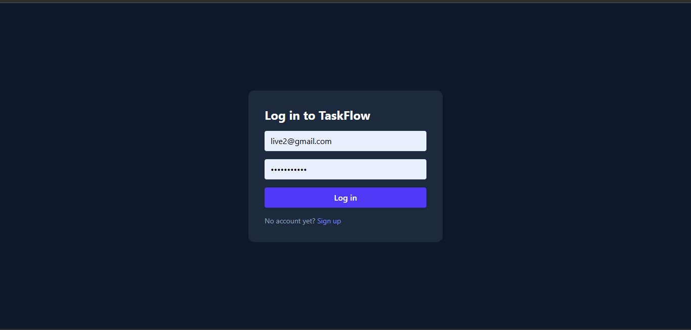

# TaskFlow

A full-stack task manager with user authentication. Users can sign up, log in, and manage their own tasks.

**Live demo:** https://taskflow-olabode.vercel.app

> The backend runs on Render's free tier, so the first request after a period of inactivity can take up to a minute while the server wakes up.




## Features

- Sign up and log in with JWT authentication
- Passwords hashed with bcrypt
- Protected routes on the frontend and API
- Create, update status (To do / In progress / Done) and delete tasks
- Each user can only see and modify their own tasks
- Responsive layout that works on phones

## Tech stack

- **Frontend:** React, TypeScript, Tailwind CSS, React Router, Axios, Vite
- **Backend:** Node.js, Express, TypeScript, JWT, bcryptjs
- **Database:** MongoDB Atlas with Mongoose
- **Hosting:** Vercel (frontend), Render (backend)

## Run it locally

1. Clone the repo:
   ```bash
   git clone https://github.com/opiper21/taskflow.git
   cd taskflow
   ```

2. Start the backend:
   ```bash
   cd server
   npm install
   ```
   Create `server/.env` with:
   ```
   MONGO_URI=your_mongodb_connection_string
   JWT_SECRET=a_long_random_string
   PORT=5000
   ```
   Then run `npm run dev`.

3. Start the frontend in a second terminal:
   ```bash
   cd client
   npm install
   npm run dev
   ```

## API routes

| Method | Route | Description |
| --- | --- | --- |
| POST | `/api/auth/signup` | Create an account |
| POST | `/api/auth/login` | Log in and receive a token |
| GET | `/api/tasks` | List your tasks |
| POST | `/api/tasks` | Create a task |
| PUT | `/api/tasks/:id` | Update a task |
| DELETE | `/api/tasks/:id` | Delete a task |

## Future improvements

- Email verification and password reset
- Due dates and status filters in the UI
- Edit task titles and descriptions
- Automated tests
